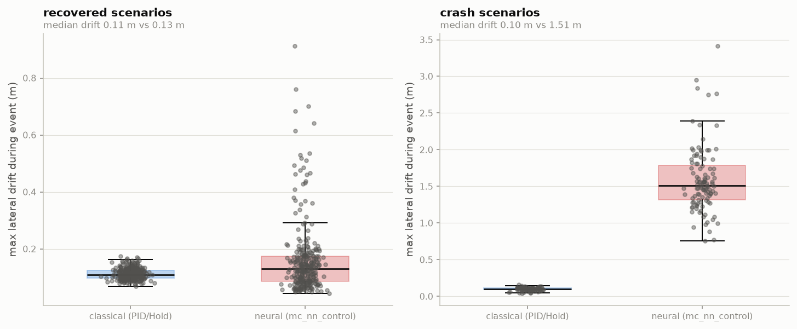

# Adversarial evidence for learned flight control

**A failure characterization of PX4's mainline neural controller, and a search
method that maps safety boundaries ~3× faster than brute force.**

PeregrineX · 30 July 2026 · [contact]

---

## Summary

Neural networks are arriving in certifiable flight control faster than the
methods to verify them. PX4 merged a TensorFlow-Lite neural position
controller (`mc_nn_control`) into mainline; the FAA has flight-tested a
camera-based neural landing system with Daedalean explicitly to inform future
ML certification policy; EASA's MLEAP and CoDANN work is building the learning-
assurance framework. What does not exist is a practical way to generate the
evidence those frameworks will demand.

We built one and pointed it at the neural controller that ships in PX4 today.
Two results:

1. **Pass/fail testing cannot distinguish a neural controller from a classical
   one that fails far more safely.** Across 800 adversarial flights, the two
   controllers show similar failure rates (27.0% vs 24.5%) and an identical
   crash boundary — but when the neural controller fails, it loses lateral
   position control in **94% of cases (102/108)**, where the classical stack
   does so in **0% (0/92)**.

2. **Guided adversarial search maps the safety boundary ~3× more
   sample-efficiently than uniform sampling**, verified across three
   independent surrogate models and audited against metric artifacts.

Both results were produced by a two-person-week effort on a laptop and free
cloud CPU. The infrastructure is autopilot-agnostic by construction.

---

## 1. Why this matters now

Certification of learned components is an open problem with a closing
deadline. The regulatory scaffolding is arriving (EASA MLEAP final report;
CoDANN I/II; SAE G-34 / EUROCAE WG-114 with ED-324), and so are the aircraft:
FAA Part 108 BVLOS rulemaking, eVTOL type certification campaigns, and
Collaborative Combat Aircraft production contracts that assume autonomy no one
has a validated method to test.

The precedent for what works already exists in adjacent domains. Berkeley's
VerifAI falsified Boeing's TaxiNet neural runway tracker in simulation and
found that the **aircraft's own shadow**, at specific sun angles and weather,
drove it off the runway — a failure mode no engineer would have enumerated,
found by search, then closed by retraining. Automotive followed the same path
from falsification to evidence, and the moat proved to be the scenario
description, the coverage metrics, and the evidence layer — not the simulator.

Aviation has no equivalent tooling. That is the opportunity.

---

## 2. What we tested

**System under test.** PX4-Autopilot mainline at commit `544bccbc`, board
configuration `px4_sitl_neural`, which compiles in `mc_nn_control` — a
TensorFlow-Lite Micro network taking 15 state inputs to 4 motor commands. The
network *is* the position controller, not a monitor bolted onto PID. Simulated
airframe: SIH quadrotor, 5 m position hold.

**Control arm.** The identical airframe and scenario flown under PX4's
classical control stack. Every claim below is a paired comparison on the same
scenario, which is the only way to separate "learned control behaves
differently" from "this scenario is hard."

**Adversarial event.** Each flight establishes a stable 5 m hold, then the
plant changes underneath the trimmed controller: a mass step (0.5–2.5×) and a
thrust-ceiling step (0.5–1.2×) at t+10 s, over static inertia (0.5–3.0×) and
drag (0–3.0) perturbations. 400 scenarios by Latin-hypercube sampling, both
arms, 800 flights, **100% scored**.

**Oracle.** Continuous safety margin, normalized so 0 is the limit: lateral
drift from the hold point (limit 3 m) and altitude error against the setpoint
(limit 2.5 m), `min()` of the two, crashes clamped to −1.0. Continuous rather
than boolean because the margin is what a search method optimizes and what an
evidence package needs to show.

---

## 3. Result 1: identical verdicts, categorically different failures

| Metric | Classical (PID) | Neural (`mc_nn_control`) |
|---|---|---|
| Failure rate | 24.5% | 27.0% |
| Crashes | 92 | 108 |
| 50% failure threshold (mass step) | 2.0–2.25× | 2.0–2.25× |
| Failure rate in pre-boundary band (1.75–2.0×) | 4% | **22%** |
| Crashes with >1 m lateral drift | **0 (0%)** | **102 (94%)** |
| Max lateral drift | 0.16 m | **3.42 m** |
| Lateral drift, *recovered* scenarios (median) | 0.11 m | 0.13 m |
| Scenarios failed by this arm alone | **0** | **10** |

Three things follow.

**The failure mode is qualitatively different, not quantitatively worse.** The
classical stack, when overwhelmed, descends while holding lateral position — a
degraded but controlled failure, the kind an operator or a higher-level
autonomy layer can act on. The neural controller loses position control as
well, drifting up to 3.4 m. Zero versus 94% is not a statistical trend
requiring careful interpretation; it is a categorical behavioral difference.

**It is a cliff, not a gradient.** In scenarios both controllers survive, they
are indistinguishable (0.13 m vs 0.11 m median drift). The network is fine
until it isn't. This is the characteristic hazard of learned components and
precisely what nominal-envelope testing cannot surface.

**The disagreement is asymmetric.** Ten scenarios fail under the neural
controller that the classical stack survives; zero the reverse. The neural
controller's failure set strictly contains the classical one's.

A conventional pass/fail campaign — the kind a test plan would specify today —
would compare 27.0% against 24.5%, find them within noise, and clear the
neural controller as equivalent. The severity difference is invisible without a
continuous, severity-aware oracle.

---

## 4. Result 2: guided search maps the boundary ~3× faster

Failure discovery in an 8-dimensional scenario space is a sampling problem, and
brute force is a serious baseline: with a 46.5% base failure rate, random
sampling finds failures easily. The scarce quantity is the **boundary** — the
thin band where the system transitions from safe to unsafe — which is what a
certification argument must characterize.

We fitted proxy oracles to a 2,000-run ArduPlane baseline (independent airframe
and autopilot, holdout R² 0.59–0.73), injected the measured ±0.07 simulator
nondeterminism as query noise, and scored strategies on distinct failure and
boundary cells discovered within a 200-query budget, against Latin-hypercube
sampling at the same budget and seeds.

| | vs uniform sampling |
|---|---|
| Composite coverage ratio | 1.54× |
| **Boundary-band points found** | **2.99× / 3.07× / 3.42×** (GBM / RF / MLP proxy) |
| Failure points found | 1.07–1.23× |

The method: an ARD Gaussian-process surrogate with marginal-likelihood
lengthscales (scenario sensitivity varies ~20× across dimensions), driven by an
expected-coverage-improvement acquisition over the cell partition rather than
margin minimization, with observations Winsorized so the surrogate spends its
capacity on the level set instead of modeling crash plateaus that earn no
additional coverage.

**Audit.** Two ways this claim could be soft, both checked: collapsing a
physically inert coordinate changes the ratio by 0.9% (the discoveries are
distinct scenarios, not bookkeeping), and the advantage holds across all three
surrogate families (so it is not an artifact of one model class). A naive
surrogate-guided baseline scored 1.006 — statistically identical to brute force
— so the gain comes from the method, not from "using a model."

---

## 5. What we also found out about the tooling

Three findings that matter to anyone building on this stack, and that a vendor
claiming coverage should have to answer for:

- **PX4's `failure motor off` injection is inert under the SIH backend.** The
  command is accepted and logged by the failure module; the simulator does not
  implement it. Scenarios with a "failed" motor fly normally. A test campaign
  built on that lever would report coverage it does not have.
- **Live parameter writes do reach the SIH plant** — a mass step from 1× to 3×
  mid-hover drops the aircraft 5 m to ground contact — so mid-flight plant
  perturbation is a valid injection mechanism where motor failure is not.
- **Telemetry-side failure modes read exactly like flight failures.** PX4
  streams position only to an endpoint it has heard from, and drops a ground
  station that stops heartbeating; either produces zero samples, which naive
  harness code scores as a crashed flight. Our first campaign scored 48
  successful hovers as takeoff failures for this reason.

The general point: the gap between "we ran 10,000 scenarios" and "we generated
valid evidence" is filled with failures of exactly this kind, and they are
silent.

---

## 6. Caveats

State them plainly, because a V&V vendor that oversells its own evidence has
no product.

- **SIH is a coarse simulator.** Simple internal hover dynamics, no wind field,
  no aerodynamic detail. Results establish *behavioral difference under plant
  perturbation*, not flight-representative failure rates.
- **Airframe mismatch.** `mc_nn_control` ships trained for an X500 V2; the SIH
  quad is a different vehicle, so degradation is expected. The classical arm on
  the identical airframe is the control for exactly this — the comparison is
  valid even though the absolute rates are not transferable.
- **Scope: hover and position hold.** No trajectory tracking, no mission-level
  behavior, no perception in the loop.
- **The search result is measured on proxy oracles**, developed offline against
  a 2,000-run ArduPlane baseline rather than live runs. Live confirmation on
  the neural controller is the immediate next step.
- **Severity beyond the crash threshold** lives in the drift metric, not the
  margin, which clamps at −1.0.

---

## 7. Where this goes

**Near term.** Run the guided search live against the neural controller and
confirm the ~3× boundary efficiency on the system under test. Extend the
scenario space to trajectory tracking and wind. Both are days of work on
existing infrastructure.

**The product.** The scenario schema, the continuous oracles, the guided search,
and the evidence package are autopilot-agnostic; nothing in the method assumed
PX4 or ArduPilot. The engagement model is to point this at a partner's stack —
on-premises, no data leaves — and deliver the failure map and evidence for a
learned component they cannot otherwise certify.

**Perception is the next frontier, and it makes the case stronger.** As
autopilots consume cameras and radar, the input space stops being samplable by
brute force entirely, and guided search stops being an optimization and becomes
the only viable method. The plant layer for that already exists in the open —
NVIDIA's Cosmos world foundation models, Gaussian-splat scene reconstruction —
and is not where a small team should compete. The search and evidence layer
above it is.

---

*Artifacts backing every number in this memo — the 800-run dataset, the search
harness and its trial log, the audit, and the flight logs — are available for
technical review.*
